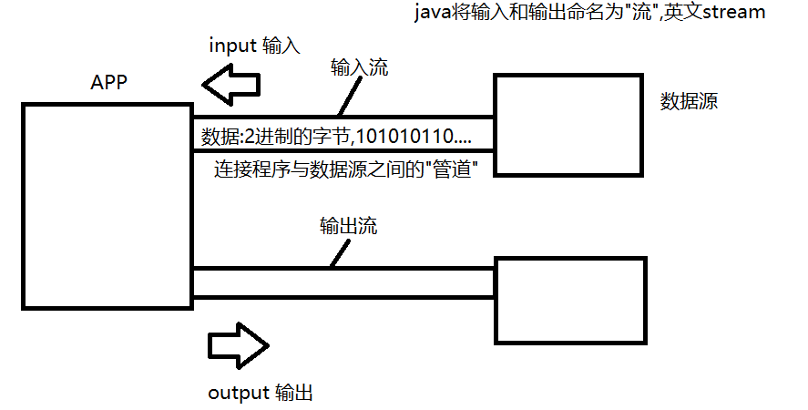
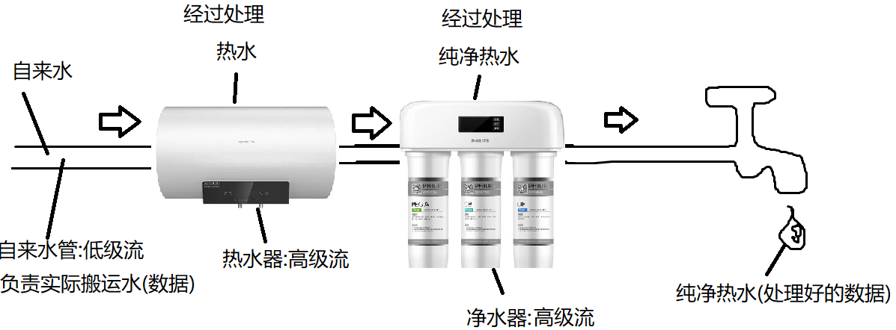

# day02
###  JAVA IO

- java io可以让我们用标准的读写操作来完成对不同设备的读写数据工作.

- java将IO按照方向划分为输入与输出,参照点是我们写的程序.

- 输入:用来读取数据的,是从外界到程序的方向,用于获取数据.

- 输出:用来写出数据的,是从程序到外界的方向,用于发送数据.


java将IO比喻为"流",即:stream. 就像生活中的"电流","水流"一样,它是以同一个方向顺序移动的过程.只不过这里流动的是字节(2进制数据).所以在IO中有输入流和输出流之分,我们理解他们是连接程序与另一端的"管道",用于获取或发送数据到另一端.



#####  Java定义了两个超类(抽象类):

- java.io.InputStream:所有字节输入流的超类,其中定义了读取数据的方法.因此将来不管读取的是什么设备(连接该设备的流)都有这些读取的方法,因此我们可以用相同的方法读取不同设备中的数据
- java.io.OutputStream:所有字节输出流的超类,其中定义了写出数据的方法.

##### java将流分为两类:节点流与处理流:

- 节点流:也称为低级流.节点流的另一端是明确的,是实际读写数据的流,读写一定是建立在节点流基础上进行的.
- 处理流:也称为高级流.处理流不能独立存在,必须连接在其他流上,目的是当数据流经当前流时对数据进行加工处理来简化我们对数据的该操作.

##### 实际应用中,我们可以通过串联一组高级流到某个低级流上以流水线式的加工处理对某设备的数据进行读写,这个过程也成为流的连接,这也是IO的精髓所在.


#### 文件流

文件流是一对低级流,用于读写文件数据的流.用于连接程序与文件(硬盘)的"管道".负责读写文件数据.

##### 文件输出流:java.io.FileOutputStream

```java
package io;

import java.io.File;
import java.io.FileNotFoundException;
import java.io.FileOutputStream;
import java.io.IOException;

/**
 * JAVA IO  Input&Output  输入和输出
 * java程序与外界交换数据是基于IO完成的，这里输入与输出一个负责读一个负责写
 * 输入:是从外界到我们写的程序的方向，是用来从外界获取信息的。因此是"读"操作
 * 输出:是从我们写的程序到外界的方向，是用来向外界发送信息的。因此是"写"操作
 *
 * java将IO比喻为"流",可以理解为是程序与外界连接的"管道",内部流动的是字节，并且
 * 字节是顺着同一侧方向顺序移动的。
 *
 * java.io.InputStream 输入流，这个类是所有字节输入流的超类，规定了所有字节输入
 * 流读取数据的相关方法。
 * java.io.OutputStream 输出流，这个类是所有字节输出流的超类，规定了所有字节输出
 * 流写出数据的相关方法。
 *
 * 实际应用中，我们连接不同的设备，java都专门提供了用于连接它的输入流与输出流，而
 * 这些负责实际连接设备的流称为节点流，也叫低级流。是真实负责读写数据的流。
 * 与之对应的还有高级流，高级流可以连接其他的流，目的是当数据流经它们时，对数据做某
 * 种加工处理，用来简化我们的操作。
 *
 *
 * 文件流
 * java.io.FileInputStream和FileOutputStream
 * 这是一对低级流，继承自InputStream和OutputStream。用于读写硬盘上文件的流
 *
 */
public class FOSDemo {
    public static void main(String[] args) throws IOException {

        //向当前目录下的demo.dat文件中写入数据
        /*
            FileOutputStream提供的常用构造器
            FileOutputStream(String path)
            FileOutputStream(File file)
         */
        //文件流创建时，如果该文件不存在会自动将其创建(前提是该文件所在目录必须存在!)
        FileOutputStream fos = new FileOutputStream("./demo.dat");
        /*
            void write(int d)
            向文件中写入1个字节，写入的内容是给定的int值对应的2进制的"低八位"

            int值 1:                         vvvvvvvv
            二进制:00000000 00000000 00000000 00000001
            demo.dat文件内容:
            00000000

         */
        fos.write(1);
        /*
                                       vvvvvvvv
            00000000 00000000 00000000 00000010

            demo.dat文件内容
            00000001 00000010
         */
        fos.write(2);


        fos.close();
        System.out.println("执行完了!");


    }
}
```

#####  文件输入流

```java
package io;

import java.io.FileInputStream;
import java.io.FileNotFoundException;
import java.io.IOException;

/**
 * end 结尾
 * read 读
 *
 *
 * 文件字节输入流，用于从文件中读取字节
 */
public class FISDemo {
    public static void main(String[] args) throws IOException {
        /*
            fos.dat文件内容
            00000001 00000011
         */
        FileInputStream fis = new FileInputStream("fos.dat");
        /*
            int read()
            读取一个字节，并一int型返回。返回的整数中读取的字节部分在该整数2进制的最后8位上
            如果返回值为整数-1,则表示流读取到了末尾。对于读取文件而言就是EOF(end of file
            文件末尾)

            第一次调用read():
            int d = fis.read();
            fos.dat文件内容
            00000001 00000011
            ^^^^^^^^
            读取该字节

            返回int值时，2进制样子:
            00000000 00000000 00000000 00000001
                                       ^^^^^^^^
            |-----补充24个0(3字节)-----| 读取的字节

            返回的int值d就是上述内容
         */
        int d = fis.read();
        System.out.println(d);

        /*
            第二次调用read()
            d = fis.read();
            fos.dat文件内容
            00000001 00000011
                     ^^^^^^^^
                     读取该字节

            返回int值时，2进制样子:
            00000000 00000000 00000000 00000011
                                       ^^^^^^^^
            |-----补充24个0(3字节)-----| 读取的字节

            返回的int值d就是上述内容
         */
        d = fis.read();
        System.out.println(d);

       /*
            第三次调用read()
            d = fis.read();
            fos.dat文件内容
            00000001 00000011
                              ^^^^^^^^
                              文件末尾了

            返回int值时，2进制样子:
            11111111 11111111 11111111 11111111
                                       ^^^^^^^^
            |-----补充32个1(4字节，来表示-1)-----|

            返回的int值d就是上述内容
         */
        d = fis.read();
        System.out.println(d);

        fis.close();
    }
}
```

### 文件复制

```java
package io;

import java.io.FileInputStream;
import java.io.FileNotFoundException;
import java.io.FileOutputStream;
import java.io.IOException;

/**
 * 文件的复制
 */
public class CopyDemo {
    public static void main(String[] args) throws IOException {
        //创建文件输入流读取原文件
        FileInputStream fis = new FileInputStream("image.jpg");
        //创建文件输出流写入复制文件
        FileOutputStream fos = new FileOutputStream("image_cp.jpg");

        int d;//保存每次读取到的字节
        /*
            原文件数据:
            11000011 10101010 00001111 11001100 00110011 ...
                     ^^^^^^^^
            d = fis.read();
            d:00000000 00000000 00000000 10101010
            fos.write(d);
            复制文件的数据:
            11000011 10101010
         */
        long start = System.currentTimeMillis();//获取当前系统时间的毫秒值(UTC时间)
        while((d = fis.read()) != -1) {
            fos.write(d);
        }

        long end = System.currentTimeMillis();//获取当前系统时间的毫秒值(UTC时间)
        System.out.println("复制完毕!耗时:"+(end-start)+"ms");
        fis.close();
        fos.close();
    }
}
```

### 块读写的文件复制操作

int read(byte[] data)
一次性从文件中读取给定的字节数组总长度的字节量，并存入到该数组中。
返回值为实际读取到的字节量。若返回值为-1则表示读取到了文件末尾。


块写操作
void write(byte[] data)
一次性将给定的字节数组所有字节写入到文件中

void write(byte[] data,int offset,int len)
一次性将给定的字节数组从下标offset处开始的连续len个字节写入文件


```java
package io;

import java.io.FileInputStream;
import java.io.FileNotFoundException;
import java.io.FileOutputStream;
import java.io.IOException;

/**
 * 通过提高每次读写的数据量，减少实际读写的次数，可以提高读写效率。
 * 单字节读写是一种随机读写形式。而一组一组字节的读写是块读写形式。
 */
public class CopyDemo2 {
    public static void main(String[] args) throws IOException {
        //使用块读写形式完成文件复制
        //创建文件输入流读取原文件
        FileInputStream fis = new FileInputStream("wnwb.exe");
        //创建文件输出流写复制文件
        FileOutputStream fos = new FileOutputStream("wnwb_cp.exe");

        /*
            流提供了块读写的方法
            int read(byte[] data)
            一次性从文件中读取给定的字节数组总长度的字节量，并存入到该数组中。
            返回值为实际读取到的字节量。若返回值为-1则表示读取到了文件末尾。

            文件数据
            11001100 11110000 10101010 00001111 00110011
            ^^^^^^^^ ^^^^^^^^ ^^^^^^^^
            int d;
            byte[] data = new byte[3];
            [00000000 00000000 00000000]
            第一次调用
            d = fis.read(data);
            [11001100 11110000 10101010]
            d = 3 本次读取到了3个字节

            文件数据
            11001100 11110000 10101010 00001111 00110011
                                       ^^^^^^^^ ^^^^^^^^
            第二次调用
            d = fis.read(data);//仅读取了最后两个字节
            [00001111 00110011 10101010]//前两个字节为本次读取的内容
             ^^^^^^^^ ^^^^^^^^
            d = 2 本次读取到了2个字节

            文件数据
            11001100 11110000 10101010 00001111 00110011 文件末尾!
                                                         ^^^^^^^^
            第三次调用
            d = fis.read(data);//一个字节都没有读取到
            [00001111 00110011 10101010]数组没变化
            d = -1 文件末尾


            块写操作
            void write(byte[] data)
            一次性将给定的字节数组所有字节写入到文件中

            void write(byte[] data,int offset,int len)
            一次性将给定的字节数组从下标offset处开始的连续len个字节写入文件

         */

        int len;//记录每次实际读取的字节量
        /*
            00000000  1byte   8位2进制称为1字节
            1024byte  1kb
            1024kb    1mb
            1024mb    1gb
         */
        byte[] data = new byte[1024*10];//10kb
        long start = System.currentTimeMillis();
        while((len = fis.read(data))!=-1){
            fos.write(data,0,len);//读取多少就写多少
        }
        long end = System.currentTimeMillis();
        System.out.println("复制完毕!耗时:"+(end-start)+"ms");
        fis.close();
        fos.close();

    }
}
```


### 写文本数据

String提供方法:
byte[] getBytes(String charsetName)
将当前字符串转换为一组字节

参数为字符集的名字，常用的是UTF-8。 其中中文字3字节表示1个，英文1字节表示1个。

```java
package io;

import java.io.FileNotFoundException;
import java.io.FileOutputStream;
import java.io.IOException;
import java.io.UnsupportedEncodingException;

/**
 * 向文件中写入文本数据
 */
public class WriteStringDemo {
    public static void main(String[] args) throws IOException {
        FileOutputStream fos = new FileOutputStream("demo.txt");
        String str = "super idol的笑容都没你的甜,";
        /*
            支持中文的常见字符集有:
            GBK:国标编码。英文每个字符占1个字节，中文每个字符占2个字节
            UTF-8:内部是unicode编码，在这个基础上不同了少部分2进制信息作为长度描述
                  英文每个字符占1字节
                  中文每个字符占3字节

            String提供了将字符串转换为一组字节的方法
            byte[] getBytes(String charsetName)
            参数为字符集的名字，名字不缺分大小写，但是拼写错误会引发异常:
            UnsupportedEncodingException
            不支持      字符集   异常
         */
        byte[] data = str.getBytes("UTF-8");
        fos.write(data);

        fos.write("八月正午的阳光，都没你耀眼。".getBytes("UTF-8"));

        System.out.println("写出完毕!");
        fos.close();
    }
}

```

### 文件输出流-追加模式

重载的构造方法可以将文件输出流创建为追加模式

- FileOutputStream(String path,boolean append)
- FileOutputStream(File file,boolean append)

当第二个参数传入true时，文件流为追加模式，即:指定的文件若存在，则原有数据保留，新写入的数据会被顺序的追加到文件中

```java
package io;

import java.io.FileOutputStream;
import java.io.IOException;

/**
 * 文件流的追加写模式
 */
public class FileAppendDemo {
    public static void main(String[] args) throws IOException {
        /*
            FileOutputStream默认创建方式为覆盖模式，即:如果连接的文件存在，
            则会将该文件原有数据全部删除。然后将通过当前流写出的内容保存到文件中。

            重载的构造方法允许我们再传入一个boolean型参数，如果这个值为true，则
            文件流为追加模式，即:若连接文件时该文件存在，原有数据全部保留，通过当前
            流写出的数据会顺序的追加到文件中。
         */
        FileOutputStream fos = new FileOutputStream(
                "demo.txt",true
        );
        fos.write("热爱105°的你，".getBytes("UTF-8"));
        fos.write("滴滴清纯的蒸馏水。".getBytes("UTF-8"));
        System.out.println("写出完毕!");
        fos.close();
    }
}

```


### 读取文本数据

```java
package io;

import java.io.FileInputStream;
import java.io.FileNotFoundException;
import java.io.IOException;

/**
 * 从文件中读取文本数据
 */
public class ReadStringDemo {
    public static void main(String[] args) throws IOException {
        FileInputStream fis = new FileInputStream("fos.txt");

        byte[] data = new byte[1024];
        int len = fis.read(data);//块读操作
        System.out.println("实际读取到了"+len+"个字节");
        /*
            String提供了将字节数组转换为字符串的构造方法：
            String(byte[]data,String charsetName)
            将给定的字节数组中所有字节按照指定的字符集转换为字符串

            String(byte[]data,int offset,int len,String charsetName)
            将给定的字节数组从下标offset处开始的连续len个字节按照指定的字符集转换为字符串
         */
        String line = new String(data,0,len,"UTF-8");
        System.out.println(line);
        System.out.println(line.length());

        fis.close();

    }
}
```

###  高级流

#### 流连接示意图



#### 缓冲流

##### java.io.BufferedOutputStream和BufferedInputStream.

缓冲流是一对高级流,作用是提高读写数据的效率.

缓冲流内部有一个字节数组,默认长度是8K.缓冲流读写数据时一定是将数据的读写方式转换为块读写来保证读写效率.

##### 使用缓冲流完成文件复制操作


```java
package io;

import java.io.*;

/**
 * java将流分为节点流与处理流两类
 * 节点流:也称为低级流，是真实连接程序与另一端的"管道",负责实际读写数据的流。
 *       读写一定是建立在节点流的基础上进行的。
 *       节点流好比家里的"自来水管"。连接我们的家庭与自来水厂，负责搬运水。
 * 处理流:也称为高级流，不能独立存在，必须连接在其他流上，目的是当数据经过当前流时
 *       对其进行某种加工处理，简化我们对数据的同等操作。
 *       高级流好比家里常见的对水做加工的设备，比如"净水器"，"热水器"。
 *       有了它们我们就不必再自己对水进行加工了。
 * 实际开发中我们经常会串联一组高级流最终连接到低级流上，在读写操作时以流水线式的加工
 * 完成复杂IO操作。这个过程也称为"流的连接"。
 *
 * 缓冲流，是一对高级流，作用是加快读写效率。
 * java.io.BufferedInputStream和java.io.BufferedOutputStream
 *
 */
public class CopyDemo3 {
    public static void main(String[] args) throws IOException {
        FileInputStream fis = new FileInputStream("ppt.pptx");
        BufferedInputStream bis = new BufferedInputStream(fis);
        FileOutputStream fos = new FileOutputStream("ppt_cp.pptx");
        BufferedOutputStream bos = new BufferedOutputStream(fos);
        int d;
        long start = System.currentTimeMillis();
        while((d = bis.read())!=-1){//使用缓冲流读取字节
            bos.write(d);//使用缓冲流写出字节
        }
        long end = System.currentTimeMillis();
        System.out.println("耗时:"+(end-start)+"ms");
        bis.close();//关闭流时只需要关闭高级流即可，它会自动关闭它连接的流
        bos.close();
    }
}

```